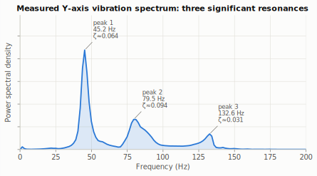
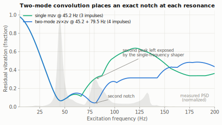
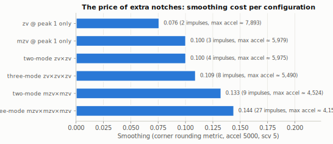
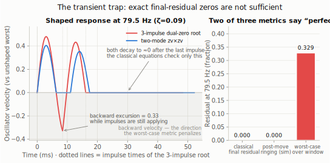
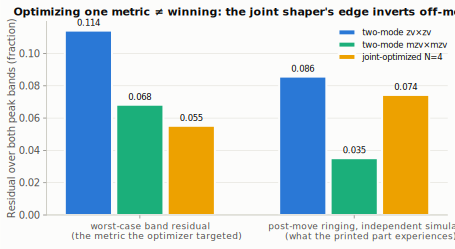
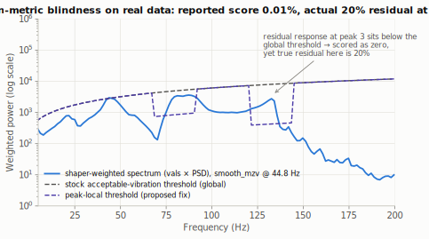
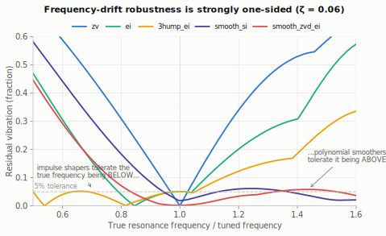

# Two-Mode Input Shaping by Convolution: Validity, Costs, and the Failure Modes of Numerically Optimized Alternatives

**Åsmund Collin** — July 2026

*Companion study to the two-mode input shaper implemented in the
[Hannott/kalico](https://github.com/Hannott/kalico) fork (branch `bleeding-edge-v2`),
and to the interactive visualizations in this repository.*

---

## Abstract

Input shaping suppresses ringing in 3D printers by convolving the commanded
motion with a short impulse train that cancels a resonance. Production
firmware (Klipper, Kalico) shapes exactly one frequency per axis, yet real
axes routinely exhibit two or more significant resonances. This paper
evaluates **two-mode shaping by convolution** — convolving two single-mode
shapers so that each contributes an exact notch — and reports an extended,
adversarial attempt to beat it with **numerically optimized joint shapers**
(Newton root-finding on the classical zero-vibration equations, and GPU
differential evolution against both the firmware's selection score and an
honest worst-case band objective). The attempt failed, and the failures are
the main contribution: we document four distinct, reproducible failure modes
that any similar effort will encounter — (1) *the transient trap*: impulse
trains that satisfy the classical final-residual equations exactly while
oscillating hard mid-window; (2) *search-grid overfitting*: optimizers that
park notches on the scoring grid's sample points; (3) an *amplitude-scaling
implementation bug* whose symptom (a perfect score) was indistinguishable
from success; and (4) *metric gaming*: the firmware's thresholded selection
score can be driven to exactly 0.000 while ~50–74 % of the vibration at a
secondary peak remains. On real accelerometer data with three resonances
(45.2 / 79.5 / 132.6 Hz) the same blindness affects stock automatic shaper
selection, which recommended a shaper leaving 20 % residual at the third
peak; a minimal *peak-local threshold* fix flips the recommendation to a
shaper with ≤ 5.4 % residual at every peak while provably preserving
single-peak behavior. We conclude that convolution is a near-optimal
construction for multi-mode shaping — its components carry transient safety
and steady-state exactness "for free" — and that the productive frontier is
not the shaper but the **selection metric**.

---

## 1. Introduction

Fast 3D-printer motion excites mechanical resonances that print as visible
surface ripples ("ringing" or "ghosting"). The standard remedy is input
shaping [1, 2]: the motion command is convolved with a small set of
amplitude-weighted impulses whose vector sum cancels the oscillatory response
at a chosen frequency. Klipper-family firmware ships a family of such shapers
(`zv`, `mzv`, `zvd`, `ei`, `2hump_ei`, `3hump_ei`) and, in Kalico's
bleeding-edge line, a family of polynomial *input smoothers*
(`smooth_zv` … `smooth_si`) [3, 4].

All of these target **one frequency per axis**. Real measurements often
disagree with that model. Figure 1 shows the Y-axis spectrum of the test
printer used throughout this study: three well-separated resonances, at
45.2 Hz, 79.5 Hz, and 132.6 Hz.



*Figure 1 — Measured Y-axis power spectral density (Klipper
`TEST_RESONANCES` sweep, X+Y+Z accelerometer sum). Three significant peaks;
half-width-derived damping estimates annotated. Because the firmware's
scoring weights the spectrum by f², the 132.6 Hz peak — only 16 % of the
dominant peak's height — carries comparable weighted energy.*

Two questions follow. First: **is convolving two single-mode shapers a valid
and worthwhile way to shape two resonances at once?** Second, and the bulk of
this paper: **can a numerically optimized impulse train do the same job with
less smoothing** — the corner-rounding cost that makes users hesitant to run
aggressive shaping? The second question produced a string of seductive false
positives before a defensible negative answer emerged, and the record of how
each false positive was caught is, we believe, more useful to the community
than the negative result itself.

## 2. Background and definitions

### 2.1 Impulse shapers and residual vibration

An input shaper is a pair `(A, T)` of `n` impulse amplitudes and times,
`sum(A) = 1`, `T₀ = 0`. For an underdamped mode with frequency `f` and
damping ratio `ζ`, the classical **final residual** after the last impulse
is [1]:

```
ω  = 2πf,   ω_d = ω·√(1−ζ²)
Wᵢ = Aᵢ·exp(−ζω·(T_last − Tᵢ))
S  = Σ Wᵢ·sin(ω_d·Tᵢ),   C = Σ Wᵢ·cos(ω_d·Tᵢ)
V(f, ζ) = √(S² + C²) / Σ Aᵢ
```

`V = 0` iff `S = 0` and `C = 0`. All classical designs (ZV, ZVD, MZV, EI…)
are closed-form solutions of these equations plus derivative/tolerance
conditions.

### 2.2 Three residual estimators (this distinction matters)

The experiments in this paper cross-check every candidate against three
estimators of "how much vibration remains", and much of Section 4 hinges on
their differences:

1. **Classical final residual** (`estimate_shaper_old` in Kalico): the
   formula above — the steady oscillation amplitude *after the last
   impulse*.
2. **Worst-case windowed residual** (`estimate_shaper`): Kalico's
   authoritative metric. It reconstructs the shaped step-response *velocity*
   over the whole shaping window (analytically, including exact evaluation at
   the impulse-time kinks) and reports the worst **backward** velocity
   excursion anywhere in the window, normalized by the unshaped worst.
   Backward motion is the physically harmful direction — it is what prints
   as ringing when moves chain together — while forward vibrational lobes
   superpose benignly on the commanded motion.
3. **Brute time-domain ringing** (this study): direct superposition of
   damped-oscillator impulse responses, measuring the steady post-move
   oscillation amplitude many cycles after the last impulse, relative to an
   unshaped impulse. Shares no code with the firmware estimators; used as an
   independent referee.

### 2.3 Smoothing

The cost of shaping is *smoothing*: corner rounding and dimensional
shrinkage. Kalico quantifies it as the worst positional offset of a shaped
90°/180° corner at a reference acceleration and square-corner velocity
(`_get_shaper_smoothing`, here always `accel = 5000 mm/s²`, `scv = 5 mm/s`).
Smoothing grows with the shaper's duration and is the axis against which all
"is it worth it" judgments are made. `find_max_accel` inverts the same
metric to a suggested acceleration ceiling.

### 2.4 The firmware selection score

`SHAPER_CALIBRATE` ranks candidates by `_estimate_remaining_vibrations`: the
shaper's frequency response (pessimized over test damping ratios
{0.075, 0.1, 0.15}) is multiplied by the measured PSD, an
*acceptable-vibration threshold* is subtracted, the excess is f²-weighted
and integrated, and the result is normalized. The code itself warns it is
"not true remaining vibrations, but rather just a score." Section 5 shows
how right that warning is: the threshold is calibrated **once, globally, to
the tallest peak**, which makes the score blind to weaker peaks.

## 3. Two-mode shaping by convolution

### 3.1 Construction

Given single-mode shapers `(A¹, T¹)` and `(A², T²)`, their convolution has
impulses at every pairwise time sum with the amplitude products:

```
(A, T) = { (Aᵢ¹·Aⱼ², Tᵢ¹ + Tⱼ²) }   (merged, normalized, shifted to T₀ = 0)
```

Because shaping is linear filtering, the residual of the convolution at
*any* frequency is the **product** of the components' residuals. A zero of
either component is therefore an exact zero of the result — the two-mode
shaper inherits an exact notch at each target frequency by construction, for
any frequency pair and any damping pair, with no numerical solving at all.



*Figure 2 — Residual response (pessimized over the firmware's test damping
ratios, which is why the notch floors sit slightly above zero) of a single
`mzv` at 45.2 Hz versus the two-mode `zv×zv` at 45.2 + 79.5 Hz, over the
measured PSD of Figure 1. The single-frequency shaper leaves the second
resonance at ~33 % residual; the convolution notches both with only four
impulses.*

### 3.2 Validity

The construction was validated three ways for representative pairs:
the classical formula, the worst-case windowed estimator, and the brute
time-domain simulation all report residuals at machine-precision zero (at
design damping) at both target frequencies — e.g. for `zv×zv` at
45.2/79.5 Hz, all three estimators return 0.000 at both peaks. The product
property also transfers the components' *transient* behavior: as Figure 4
(left) shows, the convolution's mid-window velocity never enters the
penalized backward region. This "transient safety for free" is, in
hindsight, the deep reason the optimization attempts of Section 4 failed.

### 3.3 Costs

The price is duration. Convolution durations add, so smoothing grows and the
usable acceleration ceiling drops:



*Figure 3 — Smoothing (accel 5000, scv 5) for single-, two-, and three-mode
configurations built from `zv` and `mzv` bases at the measured peaks of
Figure 1. Annotations give impulse count and the projected max-accel
ceiling.*

Two observations worth internalizing:

- **The zv-based ladder is cheap.** Adding the second notch costs almost
  nothing over a single `mzv` (0.100 vs 0.100 smoothing here — the two
  `zv` stages are short), and even the three-mode `zv×zv×zv` (8 impulses,
  0.109) is cheaper than a single-frequency `zvd` or `ei`.
- **Impulse count explodes multiplicatively** (`mzv×mzv×mzv` = 27
  impulses). Implementations need a pulse-cap guard; Kalico's discrete
  shaper buffer holds 32.

### 3.4 Mixed bases

Because the components are independent, each peak can use a different base —
an aggressive `zv` on a well-characterized peak, a damping-robust `ei` on a
noisy one. On the synthetic two-peak plant of Section 4, `zv+ei` (6
impulses) scored between the pure-`zv` and pure-`mzv` convolutions on both
vibration and smoothing, confirming mixed bases as a useful intermediate
point rather than a novelty.

## 4. Can numerical optimization beat convolution?

Convolution is generic; it does not exploit the *specific* pair of
frequencies. A jointly optimized impulse train has, in principle, more
freedom: an `n`-impulse shaper has `2n − 1` free parameters, while placing
exact zeros at two damped frequencies imposes only 5 constraints
(`ΣA = 1` plus `S = C = 0` twice). At `n = 3` the system is exactly
determined; every additional impulse adds two spare degrees of freedom that
could — in principle — buy shorter duration. This section documents what
actually happens.

### 4.1 Methods

Three search strategies were used, in escalating order of effort:

1. **Newton root-finding** on the classical equations (§2.1), with
   finite-difference Jacobians, swept over grids of starting guesses
   (dozens to hundreds of starts per configuration).
2. **GPU differential evolution** (DE/rand/1/bin, population 256–360,
   `F = 0.7`, `CR = 0.9`, 100–250 generations) over the same
   parametrization (free amplitudes, softplus-positive time gaps), with the
   full worst-case windowed metric (§2.2, item 2) ported to CuPy in FP32 and
   verified to reproduce the CPU reference to ~10⁻⁶ before any search was
   trusted. Populations were seeded with the convolution shapers themselves,
   so the search could only improve on a known-good solution.
3. **Objective variations**: (a) the firmware selection score on a
   realistic synthetic PSD; (b) the *honest* objective — worst-case windowed
   residual over ±1.5 half-width bands around every peak — under a smoothing
   budget enforced by penalty.

**Validation protocol** (adopted after the first false positive, and the
main methodological recommendation of this paper): no candidate is accepted
on the strength of the objective it was optimized against. Every winner is
re-scored on (i) the exact CPU reference metric on a fine uniform frequency
grid, (ii) the classical final-residual formula, and (iii) the brute
time-domain simulation — and it must be *physically plausible* (times
strictly increasing; amplitude behavior inspected).

The test plants: a synthetic two-peak PSD matching the measured printer
(45.2 / 81.1 Hz, ζ = 0.042, realistic Lorentzian peak widths — a resonance
peak always has a buildup and a downslope, never a single isolated
frequency), and later the real three-peak capture of Figure 1.

### 4.2 Failure mode 1: the transient trap

The very first Newton solve produced an apparent breakthrough: a
**3-impulse** shaper satisfying both exact-zero conditions to 10⁻¹⁶ with
*less* smoothing than the 4-impulse `zv×zv` convolution. Two independent
checks — the classical formula and the brute post-move simulation — both
confirmed essentially zero final residual at both frequencies.

It is not a usable shaper. The worst-case windowed metric reports **32.9 %**
residual at the second frequency:



*Figure 4 — Left: shaped step-response velocity at 79.5 Hz for the
pathological 3-impulse root (re-derived at run time to machine precision
from the recorded seed; Appendix A) and for the two-mode convolution. Both
decay to ≈0 after the last impulse — which is all the classical equations
and the post-move simulation can see. Mid-window, the 3-impulse root swings
to 0.33 of the unshaped worst in the penalized backward direction; the
convolution never enters it. Right: the same shaper scored by all three
estimators — two of three say "perfect."*

The lesson generalizes: **satisfying the final-residual equations is
necessary but nowhere near sufficient.** In continuous printing, moves chain
— the "mid-window" state is most of the time. With the windowed metric
enforced as a filter, the exactly-determined 3-impulse system has **no valid
solutions at all** (0 of 68 converged roots passed for the 45.2/79.5 pair),
and 4-impulse root-finding either found nothing valid (frequency ratio 1.76)
or found valid solutions strictly worse than convolution (ratio 1.22:
best joint duration 20.75 ms / smoothing 0.130 vs convolution's 20.18 ms /
0.128).

### 4.3 Failure mode 2: search-grid overfitting

The first DE runs against the firmware score used a coarse (0.25 Hz)
frequency grid inside the GPU objective for speed, with a fine-grid CPU
cross-check afterward. The optimizer discovered the gap: it parked notches
*exactly on the coarse grid's sample points* near the peaks, scoring ≈0 on
the search grid while the fine-grid cross-check showed up to 23 % true
residual between samples. The fix — a search grid at full resolution across
every peak band (with trapezoidal weights so non-uniform spacing keeps the
score faithful) — closed the exploit. Rule of thumb: **the optimizer will
find any place your objective is cheaper than reality.**

### 4.4 Failure mode 3: the perfect score that was a bug

One GPU port divided by the *raw* (pre-normalization) amplitude sum in two
places, mis-scaling both the residual and the smoothing for any genome whose
raw amplitudes did not sum to 1 — i.e., for every genome the DE actually
explored, while all hand-built validation shapers (which sum to 1) passed
the correctness suite perfectly. Symptom: `best_fit = 0.00000` within 25
generations at any smoothing budget. The tell was disagreement on a quantity
that *cannot* legitimately disagree: the analytic smoothing formula gave
different values on GPU and CPU for the same genome. Cautionary note for QA:
**validation suites built only from well-formed inputs will certify a
scaling bug as a breakthrough**, and an optimizer is a machine for finding
whatever your validation suite does not cover.

### 4.5 Failure mode 4: gaming the thresholded selection score

With the metric faithful (verified to 10⁻⁶) and the grid exploit closed, DE
against the **firmware selection score** still "won" — and the wins were
still fake, this time because the *score itself* is gameable. On the real
three-peak data, DE found 4- and 5-impulse shapers with a **perfect
0.0000 score** — better than every convolution baseline — while independent
simulation showed **48 % and 74 % of the vibration remaining at the
132.6 Hz peak**. The mechanism is §2.4's global threshold: calibrated to the
dominant peak, it sits far above the weaker peak's entire contribution, so
suppressing the tall peak alone zeroes the score and the optimizer happily
pockets the smoothing budget it saved by ignoring peak 3. Section 5 shows
stock calibration falling into the same hole without any adversarial
optimizer involved.

### 4.6 The honest objective: joint shapers do not dominate convolution

The remaining defensible question: minimizing the *true* worst-case windowed
residual over every peak band under a smoothing budget, can a joint
`n`-impulse shaper beat convolution? Recorded results:

**Synthetic two-peak plant (45.2 / 81.1 Hz, ζ = 0.042), bands ±1.5
half-widths:**

| configuration | impulses | band worst-case residual | smoothing |
|---|---|---|---|
| convolution `zv×zv` | 4 | 0.114 | 0.100 |
| convolution `mzv×mzv` | 9 | 0.068 | 0.132 |
| convolution `ei×ei` | 9 | 0.028 | 0.211 |
| joint DE, n = 3 (any budget) | 3 | 0.178 (floor) | 0.080 |
| joint DE, n = 4, best | 4 | **0.055** | 0.108 |
| joint DE, n = 5 (worse convergence) | 5 | 0.058–0.082 | 0.10–0.12 |

The n = 4 winner (Appendix A) looked like a genuine Pareto improvement —
lower band residual than `mzv×mzv` at lower smoothing with 4 impulses
against 9. The independent referee disagreed:



*Figure 6 — The same three shapers under the metric the optimizer targeted
(left group) and under independent post-move ringing simulation (right
group). The joint shaper's advantage inverts: on actual post-move ringing it
is barely better than the cheap `zv×zv` (0.074 vs 0.086) and clearly worse
than `mzv×mzv` (0.035), which additionally buys real robustness with its
extra smoothing. All values regenerate from the recorded impulse vectors.*

**Real three-peak data (45.2 / 79.5 / 132.6 Hz), objective = worst-case over
all three bands:** three-mode convolution (`zv×zv×zv`, 8 impulses,
smoothing 0.109) drives simulated ringing at *every* peak to ≈0. The best
joint shapers found (n = 5–7, populations to 360, 240 generations) plateaued
at **6–9 % worst-peak ringing** at comparable smoothing (best: n = 5,
smoothing 0.103, worst ringing 6.4 %), with convergence degrading as `n`
grew. No configuration matched convolution.

### 4.7 Why convolution keeps winning

A convolution's components are classical designs that are *individually*
well-behaved in every respect at once — final residual, transient window,
damping tolerance — and all of these survive the product construction. A
from-scratch optimizer receives credit only for the scalar it is scored on
and must rediscover every other property against no gradient. With few
impulses there is no slack (§4.2's DOF counting), and with more impulses the
search space grows faster than the optimizer's ability to exploit it. The
consistent picture across every experiment: **the optimizer's margin over
convolution was always exactly as large as the blind spot in the metric**,
and shrank to zero (or inverted) as each blind spot was closed.

## 5. Real-data findings: the metric, not the shaper, is the weak link

### 5.1 Stock automatic selection mis-ranks on multi-peak axes

Running this branch's actual `find_best_shaper` on the Figure 1 capture
(defaults, `scv = 5`): the winner is `smooth_mzv` @ 44.8 Hz with a reported
vibration score of 0.01 %. Its *true* worst-case residual at the three
peaks is 3.2 / 12.0 / **20.1 %**. Meanwhile `smooth_si` @ 45.7 Hz —
scored only marginally worse — has true residuals 2.7 / 3.9 / 5.2 %.
The score picked the wrong shaper, by a factor of ~4 at the worst peak.



*Figure 5 — The mechanism. The recommended shaper's weighted residual
spectrum (blue) at the 132.6 Hz peak sits entirely below the global
acceptable-vibration threshold (gray dashed), contributing zero to the
score. The peak-local threshold (violet dashed) lowers the bar only in the
neighborhood of detected secondary peaks, exposing the miss.*

### 5.2 A minimal fix: peak-local thresholds

The proposed fix (implemented on the
[`multi-peak-shaper-selection`](https://github.com/Hannott/kalico/tree/multi-peak-shaper-selection)
branch) detects local PSD maxima above 5 % of the global maximum and, within
±12 Hz of any peak weaker than the dominant one, lowers the threshold to
that peak's own PSD/f ratio. It only ever *lowers* the threshold, and only
near a detected peak, so:

- **single-peak axes score byte-identically** (verified: zero diff across
  all smoother candidates on a synthetic single-peak plant);
- on the real capture the recommendation flips to `smooth_si` @ 46.7 Hz
  (true residuals 3.4 / 3.2 / 5.4 %);
- on a synthetic two-peak plant the old metric's winner (`smooth_mzv`, 24 %
  true residual at the hidden second peak) is replaced by `smooth_zvd_ei`
  (≤ 3.8 % everywhere);
- the outcome is insensitive to both tunables across wide ranges
  (band ± 6–30 Hz, prominence 3–25 %).

### 5.3 Two-mode vs. three-mode on this printer

A final practical note from Figure 3: on this axis the two-mode shaper
leaves ~7 % simulated ringing at the un-targeted 132.6 Hz peak, while the
three-mode `zv` ladder removes it for +0.009 smoothing and 4 extra
impulses. Where the pulse budget allows, extending convolution to every
significant peak is cheap; the hard part — knowing the peaks are there and
scoring them honestly — is the selection layer's job.

## 6. How the standard shapers actually differ: one-sided robustness

Since the joint-optimization route closed, the practical question becomes
choosing well among the existing designs. Sweeping the true resonance
frequency against the tuned frequency (ζ = 0.06) exposes a structural
asymmetry that the usual "robust vs fast" summary hides:



*Figure 7 — Residual vs. frequency-mismatch ratio. Impulse shapers
(`zv`, `ei`, `3hump_ei`) widen their tolerance almost exclusively toward
the true frequency being* below *the tuned value (`3hump_ei`: −50 % / +5 %
at the 5 % tolerance); polynomial smoothers (`smooth_si`,
`smooth_zvd_ei`) widen it* above *(−6 % / +60 %). `smooth_zvd_ei` is the
only surveyed design with meaningful two-sided margin (−17 % / +60 %).*

Practical readings: if an axis's resonance drifts *up* between calibrations
(belt tensioning, cold enclosure), the "robust" EI family fails almost as
fast as ZV, while smoothers barely notice; the reverse holds for downward
drift. Damping mismatch, by contrast, is a non-issue — across the survey,
designing at ζ = 0.06 and evaluating at ζ ∈ {0.02, 0.12} moved residuals by
under 8 percentage points.

## 7. Recommendations for anyone attempting a similar shaper

1. **Score candidates on a worst-case windowed metric, never on final
   residual alone.** The transient trap (§4.2) is not an edge case; it is
   where an exactly-determined solver *will* land.
2. **Never let the search and the evaluation share an approximation.**
   Grid, precision, band selection — any shared shortcut becomes the
   optimum (§4.3).
3. **Keep one referee that shares no code with the objective.** The brute
   time-domain simulation caught both the scaling bug (§4.4) and the
   off-metric inversion (§4.6) that every code-sharing check missed.
4. **Treat a perfect score as a bug until proven otherwise** (§4.4, §4.5).
5. **Thresholded/normalized scores must be local, not global**, or an
   optimizer — or plain automatic calibration (§5.1) — will hide real
   vibration under the threshold.
6. **Benchmark against convolution seeded into your optimizer.** If the
   search cannot even hold on to the convolution genome it was seeded with
   under your objective, the objective is measuring something other than
   print quality.
7. **Spend remaining effort on the selection metric and on shaping more
   peaks, not on shaving impulses.** Both fixes in this study (peak-local
   thresholds; three-mode convolution) cost a few lines and delivered more
   real-world improvement than the entire optimization campaign.

## 8. Limitations

- All ringing numbers derive from the linear damped-oscillator model that
  underpins input shaping theory itself; no printed-part A/B comparison is
  included here. The model's rank ordering of shapers is well validated in
  the community, but absolute percentages should be read as model outputs.
- One printer's capture (Figure 1) anchors the real-data sections; the
  synthetic plants vary frequency ratio and damping, but a broader corpus of
  multi-peak captures would strengthen §5's generality.
- The DE budget (≤ 360 × 250 evaluations per configuration, FP32) is large
  but not exhaustive; we cannot prove no better joint shaper exists — only
  that within this budget every apparent win traced to a metric defect, with
  the margin shrinking as defects were closed (§4.7).
- The peak-local threshold's two constants (±12 Hz, 5 % prominence) were
  stress-tested on the available data (§5.2) but not tuned across a fleet.

## 9. Conclusion

Two-mode (and k-mode) input shaping by convolution is valid, exact,
transient-safe, and cheap in the `zv`-ladder regime — and it is genuinely
hard to beat: an extensive, GPU-accelerated, adversarially validated
optimization campaign failed to produce a joint shaper that dominates it
once every measurement defect was closed. The failures were systematic and
reproducible, and they localize the real weakness of current auto-tuning in
the **selection metric**, whose global threshold is provably blind to
secondary resonances on real hardware. A minimal peak-local correction fixes
the observed mis-recommendation while leaving single-peak behavior
untouched. We publish the failure catalog, the validation protocol, the
recorded impulse vectors, and regeneration code so that the next attempt —
and there should be one; §8 lists real openings — starts where this one
stopped instead of rediscovering its traps.

---

## Appendix A — Recorded artifacts

All vectors normalized (`ΣA = 1`), times in seconds. Regenerating code:
[`code/generate_figures.py`](code/generate_figures.py) re-verifies each
against the estimators at every run.

**A.1 — Pathological 3-impulse dual-zero root** (§4.2; modes 45.2 Hz
ζ 0.043 and 79.5 Hz ζ 0.09). Seed, refined to |eqs| < 10⁻¹³ at run time:

```
A = [0.362, 0.393, 0.245]
T = [0.0,   0.00844, 0.01611]
final residual @79.5 Hz  = 0.000     (classical formula)
post-move ringing        = 0.000     (independent simulation)
worst-case windowed      = 0.329     (authoritative metric)
```

**A.2 — Joint-optimized n = 4 winner** (§4.6; synthetic plant 45.2/81.1 Hz,
ζ 0.042; GPU DE, band-worst-case objective, smoothing budget 0.14):

```
A = [0.2539, 0.3188, 0.2736, 0.1538]
T = [0.0,    0.00618, 0.01284, 0.01935]
smoothing = 0.108,  max_accel ≈ 5541
band worst-case = 0.055   |   post-move ringing = 0.074
(convolution mzv×mzv: 0.068 | 0.035 at smoothing 0.132)
```

**A.3 — Real-data metric-gaming examples** (§4.5; DE against the firmware
score on the Figure 1 capture; per-peak values are simulated post-move
ringing at 45.2 / 79.5 / 132.6 Hz):

```
n=4, budget 0.13 → score 0.0000, smoothing 0.112, ringing [0.03, 0.10, 0.48]
n=5, budget 0.16 → score 0.0000, smoothing 0.120, ringing [0.03, 0.16, 0.74]
```

**A.4 — Stock vs fixed selection on the real capture** (§5.1–5.2; true
worst-case residual at the three peaks):

| metric | winner | @45.2 | @79.5 | @132.6 |
|---|---|---|---|---|
| stock (global threshold) | `smooth_mzv` @ 44.8 Hz | 0.032 | 0.120 | **0.201** |
| peak-local threshold | `smooth_si` @ 46.7 Hz | 0.034 | 0.032 | 0.054 |

## Appendix B — Reproduction

```
# figures (numpy + matplotlib + a Kalico checkout):
cd research/code
python generate_figures.py --kalico /path/to/kalico

# data: research/data/calibration_data_y_20260714_143508.csv
#   (real TEST_RESONANCES capture behind Figures 1, 2, 3, 5)
```

The script implements the two-mode convolution, both selection-metric
variants, and the independent time-domain referee inline; it imports only
the residual estimators and the smoothing metric from the Kalico checkout,
and prints the verification values for every recorded artifact so any drift
against future firmware versions is immediately visible. The GPU
differential-evolution harness is not required to verify any claim in this
paper — every quoted number either regenerates from the recorded vectors
above or is a recorded search output whose winners are embedded here.

## References

[1] N. C. Singer and W. P. Seering, "Preshaping Command Inputs to Reduce
System Vibration," *ASME Journal of Dynamic Systems, Measurement, and
Control*, vol. 112, no. 1, 1990.

[2] W. Singhose, W. Seering, and N. Singer, "Residual Vibration Reduction
Using Vector Diagrams to Generate Shaped Inputs," *ASME Journal of
Mechanical Design*, vol. 116, no. 2, 1994.

[3] D. Butyugin, Klipper input shaper implementation and shaper-calibration
framework: `klippy/extras/shaper_defs.py`, `klippy/extras/shaper_calibrate.py`
(the estimators, smoothing metric, and selection score studied here are his
design), https://github.com/Klipper3d/klipper and Kalico's bleeding-edge
line, https://github.com/KalicoCrew/kalico.

[4] Kalico documentation: *Resonance Compensation* and *Measuring
Resonances*, https://docs.kalico.gg.

[5] Two-mode shaper implementation and the peak-local selection fix studied
in this paper: https://github.com/Hannott/kalico (branches
`bleeding-edge-v2`, `multi-peak-shaper-selection`).
